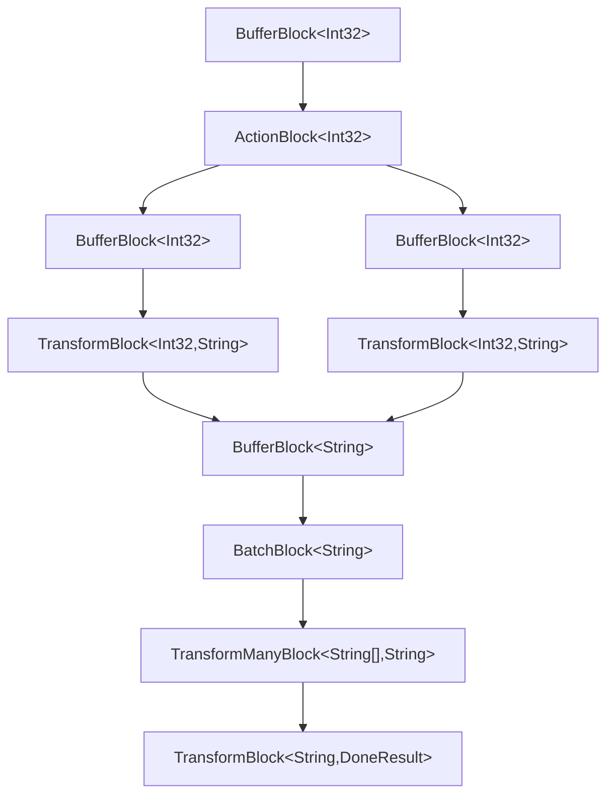
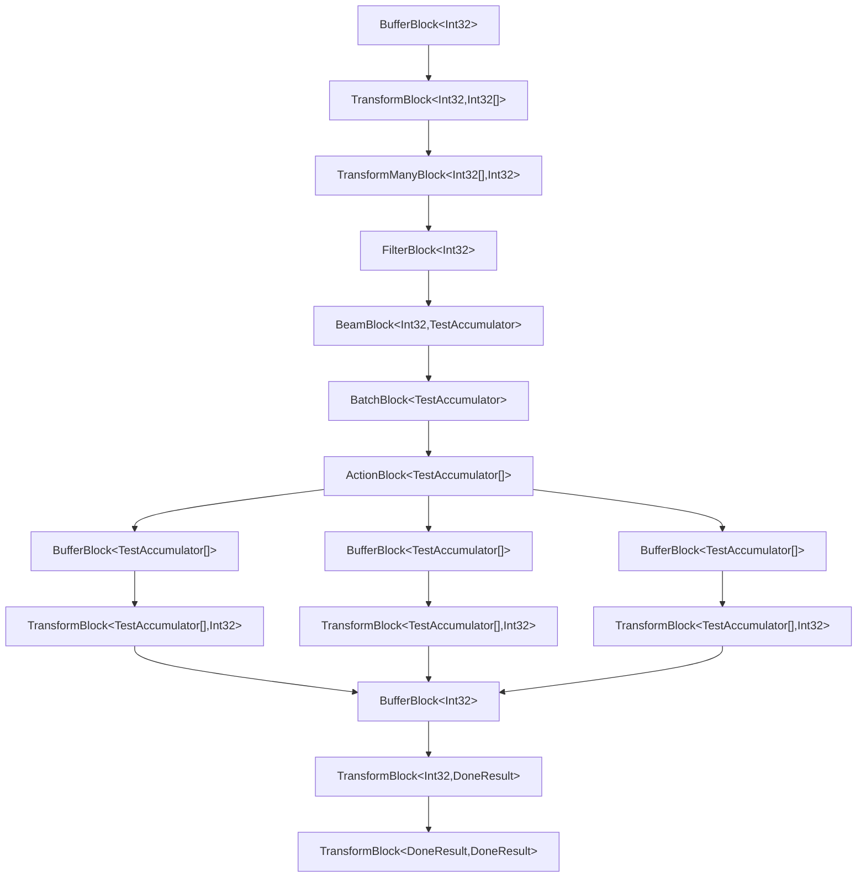

# Overivew
Extensions of the .NET TPL Dataflow Library. This package includes 2 components:

- Several custom TPL Dataflow blocks useful for various scenarios.
- A builder framework for constructing dataflow pipelines with an aim to reduce the verbosity of constructing large pipelines.

There is a strong emphasis on in-order processing and completion propagation.

Functionality provided: 
- **AggregatorBlock** - is similar to a TransformBlock, but wraps any block and gives you access to the original input and the inner output.
- **BeamBlock** - is inspired by Apache Beam, and lets you group a stream into finite time windows, and output an aggregate of each window.
- **FilterBlock** - is a simple "where" statement.
- **SequencePreservingBlock** - is used to maintain and re-order contiguous streams. Useful when a message broker might not guarantee message order.
- **ThrottleBlock** - is used to guard downstream blocks with a wall-clock throttle.
- **DataflowBuilder** - is used to construct chains of blocks.
    - Compiles down into a single IPropagatorBlock via `DataflowBlock.Encapsulate`
    - Exposes a **Kafka** method, inspired by Apache Kafka, which provides in-order parallelism.
    - Exposes **Mermaid Graph Generation** so you can see the underlying blocks generated and better understand/debug a pipeline. 

# Blocks
### AggregatorBlock
AggregatorBlock can be inserted into a TPL Dataflow pipeline to wrap any other propagator block and select out a different output as a function of (input, originalBlockOutput). 

Conceptual Example:
```txt
Input Stream: 
[
    (value: 3)
    (value: 2),
    (value: 1),
]

AggregatorBlock on InputStream: 
    - innerBlock: TransformBlock(message => message + 42)
    - aggregatorLambda: (input, originalOutput) => $"{input}-{originalOutput}";

Output Stream:
[
    (value: "3-45"),
    (value: "2-44"),
    (value: "1-43"),
]
```

Code Example:
```csharp
[Test]
public async Task ShouldAggregateInputAndOutputToFinalValue()
{
    // arrange
    var innerBlock = new TransformBlock<int, string>(i =>
    {
        return $"{i}";
    });
    var aggregatorBlock = new AggregatorBlock<int, string, (int, string)>(innerBlock, (input, output) =>
    {
        return (input + 1, output);
    });
    var aggregatedValues = new List<(int, string)>();
    var collectorBlock = new ActionBlock<(int, string)>(aggregatedValues.Add);

    aggregatorBlock.LinkTo(collectorBlock, new DataflowLinkOptions() { PropagateCompletion = true });

    // act
    aggregatorBlock.Post(1);
    aggregatorBlock.Post(2);
    aggregatorBlock.Post(3);
    aggregatorBlock.Complete();
    await collectorBlock.Completion;

    // assert
    Assert.That(aggregatedValues, Has.Count.EqualTo(3));
    Assert.That(aggregatedValues[0], Is.EqualTo((2, "1")));
    Assert.That(aggregatedValues[1], Is.EqualTo((3, "2")));
    Assert.That(aggregatedValues[2], Is.EqualTo((4, "3")));
}
```

### BeamBlock
Inspired by Apache Beam, BeamBlock lets you group an incoming stream into time windows, and then aggregate each item within a window into an arbitrary accumulator. Downstream blocks will receive these windowed accumulators.

Conceptual Example:
```txt
Input Stream: 
[
    (time: 1pm, value: 1),
    (time: 2pm, value: 2),
    (time: 3pm, value: 3)
]
Accumulator: window(int numItems, int valueOfItems)

Beam Block on Input Stream:
    - window size: 2 hours
    - summary method: (item, window) => { window.numItems++; window.valueOfItems += item.value; }

Output Stream:
[
    (numItems: 2, valueOfItems: 3), // time 1pm and time 2pm
    (numItems: 1, valueOfItems: 3) // time 3pm
]
```

Code Example:
```csharp
public class TestModelWithDateTimeOffsetTime
{
    public DateTimeOffset Time { get; set; }
    public int Value { get; set; }
}

public class TestAccumulator : IAccumulator
{
    public int Value { get; set; }
    public long WindowStart { get; set; }
    public long WindowEnd { get; set; }
}

[Test]
public void ShouldAccumulateItemsIntoWindows()
{
    // arrange
    var beamBlock = new BeamBlock<TestModelWithDateTimeOffsetTime, TestAccumulator>(
        TimeSpan.FromHours(1),
        (streamed, accumulator) =>
        {
            accumulator.Value += streamed.Value;
        },
        (streamed, timeConverter) => timeConverter.ConvertToNanosecondEpoch(streamed.Time));
    var accumulators = new List<TestAccumulator>();
    var gatherBlock = new ActionBlock<TestAccumulator>(i => accumulators.Add(i));

    beamBlock.LinkTo(gatherBlock, new DataflowLinkOptions()
    {
        PropagateCompletion = true
    });

    var streamed1 = new TestModelWithDateTimeOffsetTime() { Time = DateTimeOffset.Parse("2024-03-28T07:00:01-05:00"), Value = 1 };
    var streamed2 = new TestModelWithDateTimeOffsetTime() { Time = DateTimeOffset.Parse("2024-03-28T07:00:02-05:00"), Value = 2 };
    var streamed3 = new TestModelWithDateTimeOffsetTime() { Time = DateTimeOffset.Parse("2024-03-28T08:00:00-05:00"), Value = 2 };

    // act
    beamBlock.Post(streamed1);
    beamBlock.Post(streamed2);
    beamBlock.Post(streamed3);
    beamBlock.Complete();
    gatherBlock.Completion.Wait();

    // assert
    Assert.Multiple(() =>
    {
        Assert.That(accumulators, Has.Count.EqualTo(2));
        Assert.That(accumulators.First().Value, Is.EqualTo(3));
        Assert.That(accumulators.Last().Value, Is.EqualTo(2));
    });
}
```

Available Settings:
- OmitIncompleteFinalWindow = `true` or `false`. Example:
  ```txt
    Input Stream: 
    [
        (time: 1pm, value: 1),
        (time: 2pm, value: 2),
        (time: 3pm, value: 3)
    ]
    Accumulator: window(int numItems, int valueOfItems)

    Beam Block on Input Stream:
        - window size: 2 hours
        - summary method: (item, window) => { window.numItems++; window.valueOfItems += item.value; }

    Output Stream with OmitIncompleteFinalWindow = false (default):
    [
        (numItems: 2, valueOfItems: 3), // time 1pm and time 2pm
        (numItems: 1, valueOfItems: 3) // time 3pm
    ] 

    Output Stream with OmitIncompleteFinalWindow = true:
    [
        (numItems: 2, valueOfItems: 3), // time 1pm and time 2pm; emitted on item3
        // item 3 not emitted; didn't receive an item >= 4pm.
    ]
  ```

### FilterBlock
FilterBlock can be inserted into a TPL Dataflow pipeline to gatekeep the stream by a lambda method. 

Conceptual Example:
```txt
Input Stream: 
[
    (value: 3)
    (value: 2),
    (value: 1),
]

FilterBlock block on InputStream:
    - predicate: (message) => message.value >= 2

Output Stream:
[
    (value: 3),
    (value: 2),
    // value 1 discarded because it did not pass the predicate.
]
```

Code Example:
```csharp
[Test]
public async Task ShouldFilterForEvenNumbersOnly()
{
    // arrange
    var filterBlock = new FilterBlock<int>(x => x % 2 == 0); // even #'s only

    var actualOutputs = new List<int>();
    var outputCollector = new ActionBlock<int>(x => actualOutputs.Add(x));
    filterBlock.LinkTo(outputCollector, new DataflowLinkOptions() { PropagateCompletion = true });

    // act
    for (int i = 0; i < 10; i++)
    {
        filterBlock.Post(i);
    }
    filterBlock.Complete();
    await outputCollector.Completion;

    // assert
    CollectionAssert.AreEqual(new List<int>() { 0, 2, 4, 6, 8}, actualOutputs);
}
```

### SequencePreservingBlock
SequencePreservingBlock can be inserted into a TPL Dataflow pipeline to reorder out-of-order messages when there's a known contiguous order. Useful in pub/sub environments where a broker does not guarantee message order. 

Conceptual Example:
```txt
Input Stream: 
[
    (sequenceNumber: 3, value: 3)
    (sequenceNumber: 1, value: 2),
    (sequenceNumber: 2, value: 1),
]

SequencePreservingBlock block on InputStream:
    - sequenceIndexExtractor: (message) => message.sequenceNumber
    - SequenceInitialization: SequenceInitialization.From(sequenceNumber: 1)

Output Stream:
[
    (sequenceNumber: 1, value: 2), // emitted right when the message came in. Sequence number matched the starting sequence number.
    (sequenceNumber: 2, value: 1), // emitted right when the message came in. Was the next contiguous sequence number. 
    (sequenceNumber: 3, value: 3)  // buffer when it initially came in. Still buffered when 1 was processed. Emitted at the same time as sequenceNumber 2 because it was contiguous.
    // no pending messages when complete occurs.
]
```

Code Example:
```csharp
[Test]
public async Task ShouldReorderStreamToBeInOrder()
{
    // arrange
    var settings = new SequencePreservingBlockSettings()
    {
        SequenceInitialization = SequenceInitialization.From(1),
        OnCompleteBufferedMessageBehavior = OnCompleteBufferedMessageBehavior.Discard,
    };
    var sequencePreservingBlock = new SequencePreservingBlock<string>(sequenceIndexExtractoror: (item) => long.Parse(item), settings);

    var actualItems = new List<string>();
    var collectorBlock = new ActionBlock<string>(item => actualItems.Add(item));
    sequencePreservingBlock.LinkTo(collectorBlock, new DataflowLinkOptions() { PropagateCompletion = true });

    // act
    sequencePreservingBlock.Post("3");
    sequencePreservingBlock.Post("1");
    sequencePreservingBlock.Post("2");
    sequencePreservingBlock.Complete();
    await collectorBlock.Completion;

    // assert
    CollectionAssert.AreEqual(new string[] { "1", "2", "3" }, actualItems);
}
```

Available Settings:
- SequenceInitialization = `SequenceInitialization.FromFirstElement` or `SequenceInitialization.From(long inclusiveStartingSequenceNumber)`. Example:
  ```txt
    Input Stream: 
    [
        (sequenceNumber: 3, value: 3),
        (sequenceNumber: 1, value: 1),
        (sequenceNumber: 2, value: 2)
    ]

    SequencePreservingBlock block on InputStream:
        - sequenceIndexExtractor: (message) => message.sequenceNumber

    Output Stream with SequenceInitialization.FromFirstElement:
    [
        (sequenceNumber: 3, value: 3)
    ] 

    Output Stream with SequenceInitialization.From(sequenceNumber: 1):
    [
        (sequenceNumber: 1, value: 1),
        (sequenceNumber: 2, value: 2),
        (sequenceNumber: 3, value: 3)
    ]
  ```
- OnCompleteBufferedMessageBehavior = `Discard` (default) or `Emit`. Example:
  ```txt
    Input Stream: 
    [
        (sequenceNumber: 1, value: 1),
        (sequenceNumber: 3, value: 3)
    ]

    SequencePreservingBlock block on InputStream:
        - sequenceIndexExtractor: (message) => message.sequenceNumber
        - sequenceInitialization: SequenceInitialization.From(sequenceNumber: 1)

    Output Stream with OnCompleteBufferedMessageBehavior.Discard:
    [
        (sequenceNumber: 1, value: 1)
    ] 

    Output Stream with OnCompleteBufferedMessageBehavior.Emit:
    [
        (sequenceNumber: 1, value: 1),
        (sequenceNumber: 3, value: 3)
    ]
  ```

### ThrottleBlock
ThrottleBlock can be inserted into a TPL Dataflow pipeline to insert a wall-clock-time bottleneck in the stream. Useful when a downstream resource has a rate limit.

Conceptual Example:
```txt
Input Stream: 
[
    (value: 1), // received at 1:00pm
    (value: 2), // received at 1:01pm
    (value: 3)  // received at 1:02pm 
]

Throttle block on InputStream:
    - Throttle to 1 emitted per 2 minutes.

Output Stream:
[
    (value: 1), // emitted at 1:00pm
    (value: 2), // emitted at 1:02pm
    (value: 3)  // emitted at 1:04pm 
]
```

Code Example:
```csharp
[Test]
public void ShouldWaitForThrottleToElapseFor2ndEmit()
{
    // arrange
    var period = TimeSpan.FromSeconds(1);
    var throttleBlock = new ThrottleBlock<int>(period);
    var receivedMessages = new List<(int value, DateTimeOffset receivedTime)>();
    var targetBlock = new ActionBlock<int>(i =>
    {
        receivedMessages.Add((i, DateTimeOffset.UtcNow));
    });
    var linkOptions = new DataflowLinkOptions()
    {
        PropagateCompletion = true
    };
    throttleBlock.LinkTo(targetBlock, linkOptions);

    // act
    var startTime = DateTimeOffset.UtcNow;
    throttleBlock.Post(1);
    throttleBlock.Post(2);
    throttleBlock.Complete();
    targetBlock.Completion.Wait();

    // assert
    Assert.That(receivedMessages, Has.Count.EqualTo(2));
    Assert.That(receivedMessages.First().value, Is.EqualTo(1));
    Assert.That(receivedMessages.First().receivedTime.Ticks, Is.LessThanOrEqualTo(startTime.AddSeconds(1).Ticks).Within(TimeSpan.FromMilliseconds(100).Ticks));
    Assert.That(receivedMessages.Last().value, Is.EqualTo(2));
    Assert.That((receivedMessages.Last().receivedTime - receivedMessages.First().receivedTime).Ticks, Is.GreaterThanOrEqualTo(period.Ticks).Within(TimeSpan.FromMilliseconds(100).Ticks));
}
```

# DataflowBuilder
The builder uses generic types to let you continually chain the correct type of blocks from A -> B, B -> C, etc. It also automatically links blocks together and includes Completion Propagation.
Generally, it just chains blocks together, while keeping a DAG structure interally so a Mermaid graph can be constructed.

The `Kafka(..)` method is not a simple `AddBlock wrapper` though. Instead, this method lets you replicate an inner builder pipeline horizontally, routing to each partition via partition keys of your choosing. This allows for parallel processing while maintaining in-order processing on a per-key basis.
Within a Kafka Builder, you have access to the partitionKey if that context is needed.

The routing to each partition is accomplished by an `ActionBlock` with a `O(1)` dispatch method, as opposed to using Dataflow's `.LinkTo` which has `O(numLinks)` dispatching time. This is so large fanouts don't have a performance degredation.

The mermaid graph is just a string return from a method before a pipeline is built. Debug locally to get the mermaid graph string and visualize it via:
- VSCode and the mermaid graph extension
- via Github's Markdown editor
- via https://mermaid-js.github.io/mermaid-live-editor
- any other Mermaid graph renderer

Builder Examples:
```csharp
[Test]
public async Task SimpleExample()
{
    // arrange
    var intermediatePipeline = new DataflowBuilder<int>()
        .Filter(n => n % 2 == 1)    // filters stream to odd numbers
        .Transform(n => $"{n + 1}") // maps odd numbers to the next even number as strings
        .Build();                   // generates an IPropagatorBlock for use

    // act
    for (int i = 1; i <= 4; i++)
    {
        intermediatePipeline.Post(i);
    }
    intermediatePipeline.Complete();

    var results = new List<string>();
    var downstreamBlock = new ActionBlock<string>(s => results.Add(s));
    intermediatePipeline.LinkTo(downstreamBlock, new DataflowLinkOptions() { PropagateCompletion = true });
    await downstreamBlock.Completion;

    // assert
    /* flow:
        *  in: 1, 2, 3, 4
        *  => 1, 3
        *  => "2", "4"
        */
    Assert.That(results, Is.EqualTo(new string[] { "2", "4" }).AsCollection);
}

[Test]
public async Task SimpleActionExample()
{
    // arrange
    var sum = 0.0;
    var endingPipeline = new DataflowBuilder<int[]>()
        .TransformMany(numbers => numbers) // flatten array
        .Filter(n => n % 2 == 0)           // filters stream to even numbers
        .Transform(n => n + 0.5)           // maps even numbers to the next odd number as strings
        .Action(n => sum += n)             // add the strings to an array
        .Build();

    // act
    for (int i = 1; i <= 4; i++)
    {
        endingPipeline.Post([i, i + 1]);
    }
    endingPipeline.Complete();
    await endingPipeline.Completion; // no need (or option) to link to this pipeline downstream.// no need (or option) to link to this pipeline downstream.

    // assert
    /* flow:
        *  in: [1,2], [2,3], [3,4], [4,5]
        *  => 1, 2, 2, 3, 3, 4, 4, 5
        *  => 2, 2, 4, 4
        *  => 2.5, 2.5, 4.5, 4.5
        *  => 14
        */
    Assert.That(sum, Is.EqualTo(14.0));
}
```

Kafka Example:
```csharp
[Test]
public async Task SimpleKafkaExample()
{
    // arrange
    var results = new List<string>();
    var unbuiltPartitionedPipeline = new DataflowBuilder<int>()
        .Kafka(
            keySelector: i => i % 3,
            allowedKeys: [0, 1],                                   // can fitler out while partitioning; no n % 3 == 2 results 
            (key, builder) =>                                      // now you continue with a "recipe" builder that gets replicated per allowedKey
                builder.Transform(i => $"{i} % 3 == {key}"))       // you have access to the key
        .Batch(4)                                                  // fan partitions back in
        .TransformMany(stringBatch => stringBatch.OrderBy(s => s)) // our in-order guarantee is only per-partition, not globally; lets sort for the deterministic test assertion 
        .Action(s => results.Add(s));
    var mermaidGraph = unbuiltPartitionedPipeline.GenerateMermaidGraph(); // can debug and access the mermaid graph
    var partitionedPipeline = unbuiltPartitionedPipeline.Build();

    // act
    partitionedPipeline.Post(0); // partition 0
    partitionedPipeline.Post(1); // partition 1
    partitionedPipeline.Post(2); // partition 2; filtered out
    partitionedPipeline.Post(3); // partition 0
    partitionedPipeline.Post(4); // partition 1
    partitionedPipeline.Post(5); // partition 2; filtered out
    partitionedPipeline.Complete();
    await partitionedPipeline.Completion;

    // assert
    Assert.That(results, Is.EqualTo([
        "0 % 3 == 0",
        "1 % 3 == 1",
        "3 % 3 == 0",
        "4 % 3 == 1"]).AsCollection);
}
```
with this graph:



And a large mermaid graph with various blocks:
```csharp
var unbuiltPipeline = new DataflowBuilder<int>()
    .Transform(i => new int[] { i, i + 1 })
    .TransformMany(numbers => numbers)
    .Filter(i => i % 2 == 0)
    .Beam<TestAccumulator>(
            window: TimeSpan.FromSeconds(2),
            (i, acc) => acc.Value += i,
            (i, _) => i * 1_000_000_000)
    .Batch(2)
    .Kafka(
        keySelector: batch => batch.Count(),
        allowedKeys: [0, 1, 2],
        (key, builder) => builder.Transform(batch => batch.Count()))
    .Action(batchCounts => sum += batchCounts)
    .Action(async batchDone => await Task.Delay(1));

var mermaidGraph = unbuiltPipeline.GenerateMermaidGraph();
```
